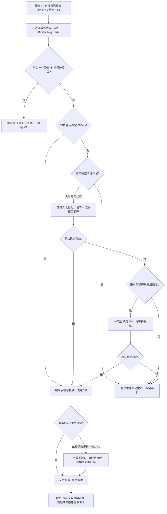

# BC03 1.7.2 · 0.1.10 适配思路

旧 1.7.2 分支保留了 VF 后状态缺失时的 15 秒等待 / 8 秒数据验证，以及音频预缓冲、断流恢复和标准全屏恢复。OEM 0.1.10 则解决清理失败后的循环断开，新增同步保存的未完成标记及当前服务暂停。直接把 OEM 包改版本文字会丢失 1.7.2 接入策略和旧分支的音频/全屏增量，因此本版明确合并这些行为。

## 连接流程

清理标记和 VF 窗口解决不同问题：前者防止跨进程重复清理，后者保护进程内异步连接请求。VF 窗口仍是进程内状态，不能宣称其 45 秒计时也跨重启保存。重启后若原车 SPP 仍占用，清理门禁继续约束接入。

## 接口与文件

| 文件/接口 | 核对结果与用途 |
|---|---|
| BC03BTService_AT+_HdLink_VP1.7.2.apk | 包 com.bt.bc03；SHA256 `32b25ec4eacada6bad179e4015f1c9ae8f9ce4df4fee9ee8baf6e99a781ede58`；仅分析，不替换 |
| gocsdk | SHA256 `3e8f5687b69623087145177358c2104aeae50f2eb943db8711af983e395ced60`；仍走已有虚拟串口与 goc_spp |
| Bluetooth.apk | 提供的样本标注 API25；不参与构建，不覆盖系统蓝牙 |
| com.bt.BTFeature | 从实际 APK 读取已验证签名/事务编号与手机 Parcelable 格式 |
| SppDisConnect / isSppConnect | 无参 void 断开事务48 / 状态事务50；返回不代表释放 |
| getConnectDevice / getLocalDeviceAddress | 事务38 / 20；使用原车模块 MAC 和真实手机，保持已保存手机匹配 |

仍核对 BC03 1.7.9 / 1.3.6 原有精确样本，缺失状态的限时验证仅用于 1.7.2。VH 是已核对的模块管理 SPP 释放命令，会影响该模块投屏通道；默认关闭且不循环发送。普通 APK 无法杀掉所有系统 SPP 或强制修复原车缓存。

## 合并与可行性

基于精确 OEM 0.1.10 APK，使清理保护、服务暂停、原首帧恢复保持；替换自编 Bc03Access/OemTransport 并加入 1.7.2 Gate。旧 1.7.2 0.1.8 APK 提供固定音频/全屏参考：严格选取三类原类、七个自编辅助类及一个诊断方法，按原类和方法逐一核对，保留新连接/首帧入口。AV 参考源码供检查和 JVM 回归；不将编译桩或测试假对象打包。

本机检查证明补丁组合、精确载荷和构建兼容性，不能证明真实原车服务会释放、VF 会获接受或手机 iAP2 握手成功。K2001N 有线整机重启与 SD8227 启动问题不在本无线适配中。实际验收要看一次连接的 P/C/S/R 阶段及首帧。
