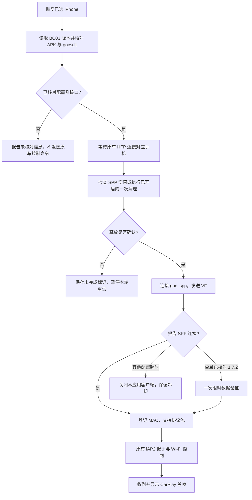

# BC03 统一适配的可行性与实现

## 能合并哪些版本

现有三个样本都使用 `com.bt.bc03` / `com.bt.BTFeature`，已核对手机 Parcel 前缀、本机 MAC、已连接手机、SPP 状态和无参 void SppDisConnect 接口。样本 gocsdk SHA256 相同，因此可以共享本地 socket 数据桥，把差异收敛到版本配置。此结论限定于提供的文件，不能推广到整个 1.7.2～1.7.9 区间。

| 配置 | BC03 APK SHA256 | 缺失状态验证 |
|---|---|---|
| 1.7.2 | 32b25ec4eacada6bad179e4015f1c9ae8f9ce4df4fee9ee8baf6e99a781ede58 | 15 秒后允许一次，8 秒无数据终止 |
| 1.7.9 | 079e6446c475eaf7d067853cf525feedbf9a9619408db6df83d873c200616326 | 不启用 |
| 1.3.6 | 40c9cd2efd64a573303cb8bd1cf9061ab0f8f43cf161bddf4fb483f617e69349 | 不启用 |

gocsdk 样本 SHA256：`3e8f5687b69623087145177358c2104aeae50f2eb943db8711af983e395ced60`。版本号与文件指纹必须成对匹配，再检查实际 Binder schema。仅更换字符串、放开所有版本号或把 T3 标准栈地址当作外接模块地址，不能实现兼容。

## 0.1.8 的 EBADF 说明

用户截图版本是 `Carplay-connect-0.1.8-beta-BC03-172-SPP-native-recovery-test`，已通过指纹校验并进入 1.7.2 专用 S3；不是没识别到 1.7.2。未出现 S4，错误 `ioctl failed: EBADF` 位于手机地址登记前后这一段。

旧代码在写出 12 字节手机地址后调用 LocalSocket 输出 flush。AOSP 实现直接把 write 交给 native，flush 却循环 `TIOCOUTQ` 等发送队列清空。如果对端没有及时消耗数据，flush 可以一直等待；旧 20 秒总计时又包括之前 15 秒状态等待，随后看门狗关闭 socket，可能使 flush 报 EBADF。此机制与截图吻合，但没有完整异常堆栈和时间戳，尚不能认定为车机唯一原因。[AOSP LocalSocketImpl 源码](https://android.googlesource.com/platform/frameworks/base/%2B/c99ba1c/core/java/android/net/LocalSocketImpl.java)

本版仅对原始 LocalSocket 输出去掉等待对端排空的 flush；不跳过 write、不吞掉 EPIPE/EBADF、不修改 iAP2 内容。上层 BufferedOutputStream 仍会刷新其自身缓冲，原始 write 继续立即发送。通道被取消或超时关闭时仍会失败，但优先报告原始关闭原因。

同时核对了已提供 gocsdk 的首包读取边界：先只读手机地址尚缺的字节，总计 12 字节，再读取协议数据。后续数据不会因为和地址一起进入内核队列而被首包读取吞掉。这限定于精确 daemon 样本，未修改或发布原厂代码。

| 建立阶段 | 时间预算 |
|---|---|
| 连接本地 socket | 5 秒 |
| 写入 VF | 5 秒 |
| 等待 SPP 状态 | 阶段 18 秒，原状态等待仍为 15 秒 |
| 复核手机 / 登记 MAC / 交接字节流 | 各 5 秒 |
| 总建立期限 | 45 秒，阶段切换不能无限延长 |
| 1.7.2 状态缺失且协议无接收 | 交接后 8 秒 |

阶段计时会终止并关闭本应用 socket。若厂商 Binder 或串口写调用自身阻塞，普通 APK 无法保证取消系统调用或修复驱动；日志会记录所在阶段，实车需确认。仅收到字节不代表 iAP2 成功；必须通过原有协议握手及首帧确认。

## 仍然保留的边界

SPP 状态来自厂商缓存，不能靠“端口可访问”“命令写出”证明无线成功。持续占用可能是真实其他会话或固件缓存残留。默认不发底层 VH；清理未确认时不循环发送 VH/VF，保存未完成记录后暂停。不会执行 factory reset、伪造释放广播、删除配对或替换系统 APK。

清理保护、首帧有限恢复与保存手机继续共用。当前选择恢复不等于原车蓝牙一定自动连接，需要原固件的 HFP 回连配合。Android API、蓝牙协议能力和实际 OEM 固件接口分别核对，不能从 CPU 或营销 Android 字样推导无线兼容性。

## 其他版本怎么扩展

先收集实际 BC03BTService APK、Bluetooth.apk、gocsdk 和 SDK_INT/日志，核对服务、Binder 描述符、交易号与参数、手机 Parcel、串口权限、socket 登记协议和状态回报，再增加独立配置与回归。若与现有接口相同可以复用桥接；若厂商服务不同应新增适配器。公开源码不包含原厂样本。
