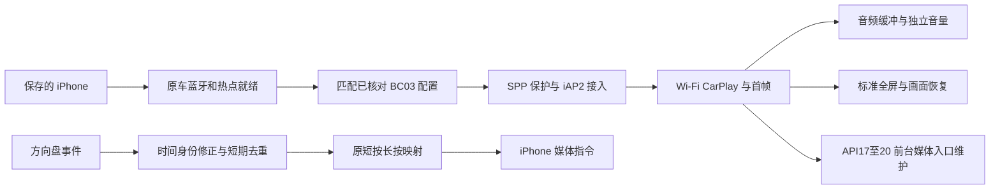

# CarConnect 0.1.12 适配条件与方案

## 安卓与硬件

| 项目 | 当前范围 |
|---|---|
| 最低安卓 | Android 4.2 / API17；含 4.4、4.4.2 / API19 运行分流 |
| CPU 与系统 | `armeabi-v7a`，3 个原生库均为 ELF32 ARM；支持 ARMv7 32 位，非 x86 通用包 |
| 打包 | DEX035、纯 V1、4 字节对齐，API17 签名验证通过 |
| 覆盖安装 | 原包名、既有证书，versionCode55；签名匹配时保留应用数据 |
| 必须具有的能力 | 正常运行的 USB/网络、Wi-Fi 热点、H.264 解码/显示、音频输出及对应蓝牙通道 |
| 系统版本判断 | 以 `Build.VERSION.SDK_INT` 为准，车机宣传中的“Android 4.4”不代替实际 SDK |

最低 API 和 ABI 符合是安装条件，不是所有固件启动、蓝牙、音视频稳定性的保证。Android 4.2 也可使用本包，Android 4.4 不会因 minSdk17 而被降级。

## 蓝牙配置

| 服务版本 | 同 APK 中的接入方式 | 已完成验证 |
|---|---|---|
| BC03 1.7.2 | VF 请求后等待原车状态；缺失 SPP 上报时允许一次限时协议验证，8 秒无接收关闭本应用客户端 | 提供样本的 APK、Binder、gocsdk 指纹及协议路径核对 |
| BC03 1.7.9 | 等待原车 SPP 已连接才交接 iAP2 字节流 | 提供样本的 APK、Binder、gocsdk 指纹及接口核对 |
| BC03 1.3.6 | 使用该样本配置，同样要求 SPP 已连接 | 提供样本及接口核对 |
| 1.7.3～1.7.8、其他版本或同版本不同文件 | 不按区间放行原车控制指令，需核对实际样本 | 未验证 |
| HSAE / 其他服务 | 本版没有增加其原车 iAP2 数据通道 | 未适配 |

蓝牙配置通过**版本、实际 APK 指纹、gocsdk 指纹及接口**联合选择。连接 `goc_spp`、VF 写出或手机 HFP 已连接都不能单独证明 iAP2/CarPlay 成功，仍须协议握手、Wi-Fi 与首帧。

## 需要哪些文件

日常安装只需要 **CarConnect APK**。原车已有的 `BC03BTService*.apk`、系统 `Bluetooth.apk`、`/system/bin/gocsdk` 保持原系统状态，无需 Root，不要求用户覆盖安装系统应用。

适配其他固件时，需私下提供上述三种实际文件，以及车机型号、实际 SDK/ABI、完整连接和蓝牙/SPP 诊断。文件用于接口核对；不应把另一车型的系统蓝牙 APK 当作普通升级包安装。

## 方向盘修正的可行性和边界

旧逻辑按 `downTime` 长期记忆去重，并在媒体备用路径记忆最后一组时间。固件若重复/归零这些时间，新的物理按键可能与旧事件相同。本版先生成每次物理按下的时间身份，再进入原映射与长按逻辑；同一次按键在 Activity/媒体入口重复投递仍去重。常规不同时间的快速按键分别处理；完全相同时间、200ms 内的重复脉冲视为回声，无法从同样的固件信息中判断用户是否再次极快地按下。

API17～20 的旧媒体入口在连接时建立，CarPlay 处于前台且窗口有焦点时每 3 秒重新登记已有接收组件/RemoteControlClient。回到前台立即维护，后台、失焦、离开 CarPlay或断开时不登记；不新建媒体客户端、不申请全局音频焦点或更改系统音量。API21 及以上保留原 MediaSession，仍使用新的事件时间处理。

修正的是代码中可复现的过滤和一次性登记问题，尚不能断言用户机型的切歌故障根因已证实。若固件完全不投递按键，或 iPhone 拒绝媒体指令，普通 APK 无法保证恢复。

## 已知限制

K2001N 有线整机重启、SD8227 专用启动/MultiDex、厂商独立浮动 Dock、无法释放的原车 SPP 以及高负载音视频问题没有全部解决。主机回归不代替车机长时间实测；GitHub 正式发布状态只表示当前正式发布入口。
