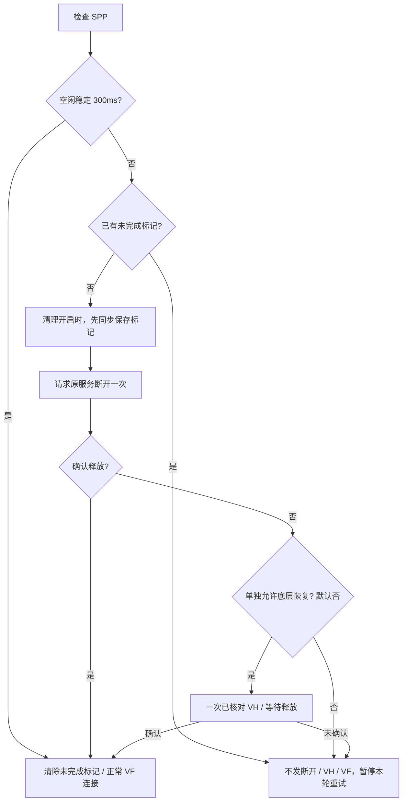

# OEM 0.1.10 SPP 重试保护分析 · 2026-10-10

最新截图有多轮 C1/C2/C4 和超时，均“未发送 VF”。可以确认清理没有完成，不能确认占用应用，也不能确认缓存一定失效。旧代码把该故障交给普通 Failed/ControlEnded 自动重试：15/30/60 秒退避后再次进入，45 秒清理冷却过后允许再次发送。因而存在反复清理干扰的代码路径，而不是所有情况下静态推断“这次已成功释放”。

## 修改思路

1. `SppRecoveryPrefs` 使用既有增强偏好文件下的新键 `sppRecoveryPending` 和 `sppNativeRecovery`。请求前 `commit()`，失败就不发送清理；默认禁止 native，不从旧 `oemSppCleanup` 推导允许 VH。原键和手机记录不改。
2. `SppRelease` 接受真实偏好控制器：空闲确认后清除标记；仍占用且已有标记时拒绝重发。对待迟到释放、状态抖动、取消和手动重试的冷却保留检查。请求返回不是成功。
3. 仅给这类失败打上与当前 controller 对应的 `OemSppPause` 标记，在原服务经过 generation 校验后的失败关闭点，使用已有 `stopSession(true,false)`。它暂停当前服务，移除轮询/重试并通过原 worker 关闭。其他失败继续 `stopSession(true,true)`；有线、其他 controller 和同步替换会话不被标记误伤。
4. native 选项在等待结束和实际写出之前复查；关闭选项不继续 VH。继续核对服务指纹、手机/模块地址、已有 VF 窗口、串口路径与本应用所有权。
5. 手动解除暂停与 `open()` 共用 opening CAS，正在建立或使用本应用通道时不能清标记。按钮不调用原车接口、不启动会话、不伪造释放。

## 明确的边界

BC03 `isSppConnect()` 仍依赖原车服务的内存标志。本版不绕过它；无法在只有“连接”且没有新回执的证据下安全断言通道已空闲。普通 APK 也不能保证杀掉所有系统 SPP。人工关闭/开启原车蓝牙是定位或恢复的尝试，不保证这台固件清除全部缓存。

没有新增蓝牙版本支持：仍是已核对 BC03 1.7.9 / 1.3.6 APK 和 gocsdk 精确 SHA256。Android 最低 API17，32 位 ARMv7，保留原 MultiDex 启动结构；不含 SD8227 专用启动修复，不修复有线整机重启。

不能把主机 40 项用例当作车机验收。需要实测空闲连接成功、清理失败后没有再次 C2/C4、强制重开应用保持未完成保护、原车恢复空闲后正常连接、已保存手机保留，以及正在播放的会话不被清理。
