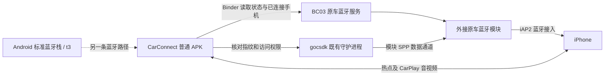
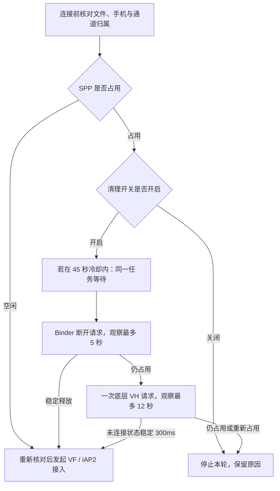
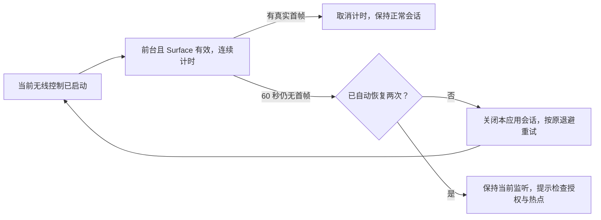

# CarConnect 原车蓝牙无线接入方案

可行性、实现思路、适配范围与文件清单 · 2026-10-09

本文以 **CarConnect 0.1.9 OEM / BC03 1.7.9** 为当前方案，另外说明 BC03 1.7.2 分支的差异。浏览器打开的发布页不代表车机实际安装版本。[图文离线版](OEM-WIRELESS-FEASIBILITY.zh-CN.html)可下载后用浏览器打开。

## 1. 可行性结论

**这套方案在具备已核对 BC03 服务、gocsdk 和可访问数据通道的车机上具备可行性。用户已反馈此前版本能够无线连接，证明这条接入路线在部分现有环境中可以走通；尚未证明所有兼容车机都能稳定回连。**

普通 APK 利用车机已有的厂商服务和数据端口，不需要 Root，也不需要替换系统蓝牙。当前最有把握解决的是连接任务反复进入冷却、保存手机恢复，以及无线控制启动后没有首帧的有限恢复。持续 SPP 占用仍需要运行时证据区分，不能保证通过普通 APK 一次性清除。

**2026-10-09 实车反馈更新：OEM 0.1.9 / BC03 1.7.9 仍出现接入前清理失败。** Binder 返回已连接，原接口返回和一次 VH 写出后，观察到的状态变化及新 SPP 广播均为零；最终“SPP 底层清理超时，未发送 VF”。另有一次“原车蓝牙连接已取消”，完整会话日志缺失，取消来源尚未确认。当前不能区分真实占用、重新占用和服务缓存残留，不能把其他应用当作已确认的占用方。首帧恢复此时尚未启动；合并主分支不表示这一故障已经修复。

| 目标 | 当前可行性与依据 | 实际限制 |
| --- | --- | --- |
| 读取原车蓝牙、通话连接手机与模块地址 | 已有文件核对和用户状态截图支持 | 服务要允许普通应用绑定；返回地址必须有效 |
| 通过外接模块启动无线 CarPlay | 用户反馈此前能够连接；字节流接入已实现 | 需要匹配的模块协议、文件指纹、端口权限、iPhone 授权和热点 |
| 重启后恢复已选择手机 | 已实现持久保存，原存储逻辑未改 | 保存选择不等于让原车 HFP 自动连上；卸载或清数据会丢失 |
| SPP 冷却期间避免反复报错 | 0.1.9 改为同一任务等待，主机回归通过 | 不代表占用方已退出，也不消除原厂缓存错误 |
| 连接后无首帧自动恢复 | 0.1.9 实现前台 60 秒、最多两次恢复 | 只在无线控制启动后生效；不能修复接入前清理失败 |
| 普通 APK 杀掉后台所有 SPP | 不能无条件实现 | 本方案只请求释放已核对模块管理的 SPP，不具备全系统控制权限 |
| 解决 USB/NCM 引起整机重启 | 当前方案没有覆盖 | 有线故障需要独立分阶段诊断，不能靠无线适配宣称已修复 |

证据分为三类：**代码与文件静态核对、主机回归测试、用户实车反馈**。作者没有在目标车机执行这版 0.1.9，不能把主机测试等同于整车验收。

## 2. 方案架构与连接思路

车机的 Android 标准蓝牙栈与外接原车模块可能是两条路径。标准栈显示 `t3`，不代表它能访问原车 `BC8-Android` 模块上的已连接 iPhone。把名称改成原车名称，也不会让两个蓝牙栈合并。

本方案从 BC03 读取真正的手机和模块地址，通过 gocsdk 的既有数据通道建立 iAP2，随后由原有 CarPlay 控制器接续到 Wi-Fi。**蓝牙承担发现和接入，主要 CarPlay 音视频走 Wi-Fi；“蓝牙音乐已连接”不能证明 iAP2 已建立。** 这段数据路径来自本项目实现，不代表任意蓝牙音乐模块都支持无线 CarPlay。

实际接入按以下顺序进行：

1. 启动时只读检查原车状态，避免还未连接就消耗清理冷却。
2. 读取原车已连接的通话手机及模块 MAC，核对与保存的 iPhone 一致。
3. 核对 BC03 APK、gocsdk 文件哈希、Binder 描述符与接口格式。
4. 检查 SPP 状态：空闲则继续；占用且清理开关开启才请求释放。
5. 先调用原车 `SppDisConnect()`，无效时才使用已核对 gocsdk 的一次底层释放。
6. 释放后重新核对手机和通道，连接 `/dev/socket/goc_spp`；通过 `/dev/goc_serial` 发起带 iAP2 服务 UUID 的连接请求。
7. 观察 SPP 接续状态，完成 socket 地址登记，把字节流交给原有 iAP2 与无线 CarPlay 控制逻辑。
8. 等待真实首帧；出现首帧后取消首帧恢复计时。

同一时间只允许一个接入任务。控制器切换、换手机、关闭开关或取消时退出旧任务，避免同时创建连接或清理本应用正在使用的通道。

## 3. SPP 清理、冷却与首帧恢复

### SPP：先确认释放，再建立新连接

图中省略了所有阶段的取消与重新核对。冷却期间若发现通道已稳定空闲，会提前继续，不再发清理请求。

| 参数或记录 | 当前含义 |
| --- | --- |
| 清理请求间隔 45 秒 | 两次清理尝试的最小间隔；0.1.9 在同一个任务里等待剩余冷却 |
| Binder 等待 5 秒 | 原服务请求返回后，观察 SPP 状态是否释放 |
| 底层等待 12 秒 | 原接口无效后写一次 VH，再观察状态 |
| 稳定窗口 300ms | 清理后未连接标志连续稳定才继续接入 |
| 清理状态观察约 17.3 秒上限 | 不含可能额外等待的最多 45 秒冷却，也不保证厂商 Binder/设备调用本身绝不阻塞 |
| VF 保护窗口 45 秒 | 对可能仍在原厂处理的旧连接请求保留保护，避免与清理或新请求碰撞 |
| C0 | 正在同一任务等待冷却；不必反复点击 |
| C2 / C4 | 原接口返回 / 底层命令写出；都不等于释放成功 |
| C3 / C5 | 观察到对应阶段的稳定释放，继续原接入流程 |

“VH 已写入”和“SPP 状态仍占用”并不矛盾：写入成功只说明请求送出。占用可能是真实连接、其他应用重新连接，或原车服务缓存没有收到回执；当前截图不能判定是哪一种。

0.1.9 新增 `SPP 观察`：记录 Binder 缓存值、变化次数、最近广播与清理后的广播次数。广播只提供诊断线索，不用于绕过占用检查。原厂 `btReset` 的一个实现涉及 DFLT，因此本方案不把它作为普通 SPP 恢复操作，也不自动重启整个蓝牙模块。

### 首帧：对已经启动的无线会话做有限恢复

前台计时不包含后台或 Surface 丢失时间。恢复开关默认开启并保存，自动连接关闭、有线模式、会话取消或服务销毁时不执行恢复。重试走原有 15～60 秒退避，不立即并发重连。

**这里检测的是“始终没有首帧”，不是“播放一段时间后画面卡住”。** 后一种视频停滞以及快速刷新导致音频卡顿需要另一套音视频诊断，本次恢复功能不宣称解决它们。

## 4. Android 与 CPU 适配范围

当前 OEM 0.1.9 的包名是 `com.shihab.diplay.legacy`，minSdk **17**、targetSdk **28**、versionCode **51**，DEX **035**，原生库是 **armeabi-v7a / ELF32**，采用与此前版本相同的 **V1 签名证书**。

minSdk 是最低安装 API 要求，targetSdk 决定部分系统行为，不代表只能运行 Android 9。[Android uses-sdk 官方说明](https://developer.android.com/guide/topics/manifest/uses-sdk-element)。文件名里的“Android4.2-4.4”表示旧系统目标范围，不是把车机系统降级成 4.2。

| 实际系统 | API | 本方案应如何理解 |
| --- | ---: | --- |
| Android 4.1 及更低 | 16 及以下 | 低于当前 minSdk，不在本包范围 |
| Android 4.2 / 4.2.2 | 17 | 满足最低 API；新增代码按 API17 编译；尚不能据此保证每台原生 4.2 都能启动和连接 |
| Android 4.3 | 18 | 满足最低 API；没有单独的实车验收证据 |
| Android 4.4 / 4.4.2 | 19 | 本方案重点目标；仍须核对原车服务、权限和原生库运行情况 |
| Android 5.x～8.x | 21～27 | API 下限满足；厂商服务、SELinux、节点权限和解码器需逐机验证；1.7.2 用户截图曾显示 API25，而非证明 OEM0.1.9 全面支持 |
| 更高 Android 或纯 64 位环境 | 28 及以上 / 不含32位支持 | 未作本方案通用验收；仅凭版本较新不能判断能用，纯64位环境不适配现有ARMv7原生库 |

以应用诊断显示的 `SDK_INT` 和 ABI 为准，不能只信设置页的 Android 字样或车机型号。QuadCore-T3 只是 CPU 信息，不足以判断 BC03 服务版本和端口是否开放。

两个容易误解的安装规则：

- 原生 Android 4.4 验证 V1；**有效 V1+V2 双签名并不会仅因包含 V2 就被 AOSP4.4 拒绝**。旧系统忽略 V2、验证 V1，纯 V2 才缺少旧系统需要的签名。当前包使用纯 V1 以固定旧系统测试条件。[AOSP 签名说明](https://source.android.com/docs/security/features/apksigning/v2)。
- 通用 APK 可以包含多个 ABI，系统会选择适配的原生库；包含 arm64 本身不是解析失败依据。当前包的实际原生库为32位 ARMv7。[Android ABI 官方说明](https://developer.android.com/ndk/guides/abis)。

SD8227 的启动兼容另有独立分支。本 OEM 包没有合入该分支的 MultiDex 启动修复；“可安装”不等于“可启动”或“可无线连接”。K2001N_HDKJ_S112406 此前的有线整机重启也是独立问题，应继续走无线验证。

## 5. 蓝牙版本与分支选择

这里的 **BC03 1.7.9 / 1.7.2 / 1.3.6 是原厂服务 APK 版本**，不是 Bluetooth Core 4.0 / 4.2 / 5.x。现有文件不足以确定所有外接模块的 Core 版本，也不能按“蓝牙5.0”直接承诺兼容。

| 原车服务或模块 | 当前选择 | 核对与验收范围 |
| --- | --- | --- |
| BC03 1.7.9 | 当前 OEM 0.1.9 | 用户确认的目标；文件指纹和 Binder 已核对，0.1.9 尚待实车回连验收 |
| BC03 1.3.6 | OEM 白名单包含该样本 | 接口及文件已有静态依据；不代表这版已在该服务实车验证 |
| BC03 1.7.2 | 独立 0.1.8 BC03-172 分支 | 同一 gocsdk 样本，但额外包含状态缺失时的限时数据验证；当前 OEM0.1.9 不接受1.7.2 APK指纹 |
| 同样标注1.7.9但文件哈希不同 | 需要重新核对 | 版本号相同不能代替字节指纹与接口核对 |
| HSAE / com.hsae.bluetoothservice | 当前 BC03 实现不适用 | 抽象接口思路可复用，必须另外核对 Binder、UUID连接与二进制数据通道 |
| Android 标准蓝牙栈 / t3 | 另一条标准连接路径 | 不能用标准栈地址冒充原车外接模块地址 |
| 普通 USB 蓝牙棒、其他未知模块 | 尚未适配 | 插入硬件不等于 Android有驱动，也不等于支持本厂商数据接口 |

当前文件白名单：

| 文件样本 | SHA-256 | 备注 |
| --- | --- | --- |
| BC03 1.7.9 APK | `079e6446c475eaf7d067853cf525feedbf9a9619408db6df83d873c200616326` | 当前OEM样本 |
| BC03 1.3.6 APK | `40c9cd2efd64a573303cb8bd1cf9061ab0f8f43cf161bddf4fb483f617e69349` | 当前OEM样本 |
| BC03 1.7.2 APK | `32b25ec4eacada6bad179e4015f1c9ae8f9ce4df4fee9ee8baf6e99a781ede58` | 只在独立172分支接受 |
| `/system/bin/gocsdk` | `3e8f5687b69623087145177358c2104aeae50f2eb943db8711af983e395ced60` | 当前已核对的993828字节样本 |

1.7.2 特殊路径会在 SPP 状态缺失时按既有15秒等待与8秒数据超时进行有限验证，仍以原 iAP2 结果为准。**该机制不是允许绕过持续占用，不能简单把当前 OEM0.1.9 的 APK拿到1.7.2车机上替代。**

## 6. 需要哪些 APK 和文件

### 用户使用：新增安装一个 CarConnect APK

| 项目 | 是否需要新增安装 | 用途和要求 |
| --- | --- | --- |
| CarConnect 0.1.9 OEM 测试 APK | **需要** | 当前1.7.9方案；覆盖安装，保留数据 |
| `BC03BTService_AT+_HdLink_VP1.7.9.apk` | 通常已在系统中，**不作为新增安装步骤** | 原车蓝牙服务，包名 `com.bt.bc03`；普通重装不能替代系统集成和硬件配置 |
| 原车蓝牙操作界面 | 保留车机已有版本 | 完成初次配对、连接通话蓝牙和开关操作；界面应用名称因固件而异 |
| `Bluetooth.apk` | **不要跨固件覆盖安装** | 通常是 `com.android.bluetooth` 标准系统组件，不等同于BC03外接服务 |
| `/system/bin/gocsdk` | 已随固件运行，**不是APK** | 原厂守护进程；不要求用户复制、替换或启动陌生二进制 |
| GocSdk服务APK | 当前方案没有额外安装要求 | 不能把同名 `com.goodocom.gocsdk` APK 当成本方案所需的native守护进程 |
| CarLife、其他投屏APK | 不需要 | 同时工作时可能重新占用SPP；仅卸载某个前台应用并不能证明后台通道释放 |
| iPhone 端APK/第三方客户端 | 不需要 | 使用iPhone原有CarPlay；接受手机显示的授权提示 |

当前安装包：`CarConnect-0.1.9-beta-OEM-first-frame-diagnostics-test-Android4.2-4.4.apk`。

**普通使用时，不需要把原厂蓝牙 APK 和 gocsdk 全部装一遍。它们是车机已有的运行依赖，也是开发者排查新固件时的输入。**

### 适配另一台车机：建议提取的资料

| 输入 | 是否必需 | 需要确认的问题 |
| --- | --- | --- |
| 实际运行的BC03服务APK | BC03方案必需 | 包名、版本、哈希、Manifest、Binder描述符、事务编号、设备Parcel格式 |
| 实际 `/system/bin/gocsdk` | 本底层桥接方案必需 | 是否为相同协议与二进制，VF/VH、SPP端口和串口路径是否一致 |
| `Bluetooth.apk` | 建议提供，辅助 | 标准栈版本及系统集成；不直接证明BC03路径可用 |
| 原车蓝牙界面APK、关联厂商服务APK | 按情况提供 | 配对、自动回连和profile状态由哪一层管理 |
| 当前CarConnect完整诊断 | 必需 | SDK_INT、CPU/ABI、服务与端口结果、C/R阶段、收发、视频状态 |
| SPP占用前后诊断和操作时间 | 占用问题必需 | 请求是否收到回执、是否重新占用、是否仅缓存未更新 |
| 系统日志/权限信息 | 有条件时提供 | 服务拒绝、SELinux、节点权限、崩溃和解码器异常；普通用户不一定能读取全部底层日志 |

用户以前提供的1.7.2 `Bluetooth.apk` 自身标注7.1.1/API25，另一次运行截图显示Android8.1/API25。这些冲突说明应逐项读取真实运行信息，不能从一个系统APK推断整台车机版本。

## 7. 安装和日常使用手册

首次只做一次设置：

1. 在原车蓝牙界面配对iPhone，并确认**通话蓝牙已连接**。
2. 开启车机热点，保持iPhone蓝牙和Wi-Fi开启；手机上确认CarPlay授权，检查CarPlay网络自动加入。Siri和Wi-Fi设置可参考[Apple官方CarPlay说明](https://support.apple.com/en-us/108415)。该官方说明不证明本实验APK取得官方认证。
3. 安装适合服务版本的CarConnect；开启“使用原车蓝牙连接iPhone”，选择/更换iPhone并保存，开启自动连接。
4. 原车SPP可能被占用时，开启“连接前自动清理原车SPP（含底层恢复）”；开启会释放该模块管理的其他SPP投屏连接。
5. OEM0.1.9中“无线无首帧时自动重连”默认开启，可以关闭并保存。

以后上车：原车连接该iPhone、热点可用、打开CarConnect，等待一轮结束。**不用反复选择手机，也不用看到C0就重新点连接。** 保存手机不等于承诺系统自动启动CarConnect；本方案说明的是应用启动后的恢复。

换手机时明确使用“选择/更换iPhone”。升级采用同包名同证书覆盖安装，不卸载、不清数据。BC03服务的配对记录由原车管理，CarConnect保存的是用户选择；两种记录不是同一份。

如果仍失败，看最后停在哪一段：

持续清理失败时，先关闭“自动连接”，停止多轮重试并等待至少 60 秒，让当前任务退出和清理冷却结束。在没有通话时，可人工关闭再开启原车蓝牙，再连接已配对 iPhone；这会暂时中断原车通话和蓝牙音乐，不需删除配对记录。回到 CarConnect 先复制“原车通道诊断”，再开启一次自动连接，等待一轮结果后复制“原车通道诊断”和“诊断信息”完整文本，私下反馈。保留最初的取消/失败前后记录；不要只提供冷却倒计时。上述操作用于定位，并非保证清理成功的修复。

| 最后阶段 | 优先判断 |
| --- | --- |
| 原车HFP尚未连接 / 无有效MAC | 回原车界面确认已连接目标iPhone，不只看音乐连接 |
| 文件指纹不匹配 | 运行文件与样本不同，需要重新适配；不绕过校验 |
| C0等待 | 等当前任务，期间不重复清理 |
| C4后超时，未发送VF | 接入前尚未确认释放，复制完整SPP观察；首帧重试在此无效 |
| VF后没有SPP连接状态 | 原车接续或回执问题；172分支有专门有限验证，OEM分支不假定成功 |
| iAP2结束、无线已准备但没有首帧 | 检查手机授权、热点与视频状态；0.1.9可能触发R3有限恢复 |
| received增加但decoded不增加 | 优先检查解码输入或解码器；不直接归因于蓝牙 |
| decoded增加但texture不增加 | 优先检查视频输出Surface/纹理更新 |
| 已播放后冻结，或快速刷新音频卡顿 | 属于持续音视频性能问题，不能用无首帧计时当成修复 |

## 8. 现有验证与下一步验收

0.1.9已通过 **51项主机JVM回归**：12项首帧策略、11项执行器集成、22项SPP释放/冷却、6项状态观察。API17编译、签名、ZIP对齐、载荷和DEX差异审计通过。模拟测试没有执行原车Binder、真实PTY、蓝牙模块或iPhone。

建议实车按以下顺序记录结果，次数字段是建议验收指标，不是已完成的数据：

| 场景 | 建议验收方式 | 通过标准 |
| --- | --- | --- |
| 首次设置 | 完成一次配对与选择 | 正常显示首帧，音乐和控制可用 |
| 正常重启 | 连续5次，记录到首帧耗时 | 手机选择保留，无需手选，能完成回连 |
| SPP清理 | 占用时启动一次，不反复点击 | 有C3/C5，或给出明确超时；不把C4当成功 |
| 冷却重试 | 在冷却窗口内触发一次 | C0等待，不重复VH/VF，取消和换手机立即终止旧任务 |
| 无首帧 | 授权/热点异常时观察R1/R3 | 只在符合条件时重试，最多两次；不影响正常已出首帧的会话 |
| 退到后台 | 无首帧时切换到其他页面 | 后台不消耗连续前台60秒期限 |
| 音视频压力 | 先用30fps连续导航/音乐30分钟 | 单独记录音频卡顿和后续画面冻结，不与SPP清理混淆 |

如果持续占用，下一步应围绕“回执是否产生、缓存是否更新、是否被重新连接”收集完整记录，而不是增加断开频率。新厂商接入应实现独立适配器，先做状态和传输验证，再复用上层控制逻辑；不能只添加版本号白名单。

## 9. 发布、构建与参考依据

| 内容 | 入口 |
| --- | --- |
| 当前OEM0.1.9 APK、补丁源码及说明 | [0.1.9 OEM发布页](https://github.com/beidouxiaonan/CarConnect/releases/tag/v0.1.9-beta-oem-first-frame-diagnostics-test) |
| OEM代码分支 | [codex/oem014-spp-cleanup](https://github.com/beidouxiaonan/CarConnect/tree/codex/oem014-spp-cleanup) |
| 独立BC03 1.7.2 0.1.8版本 | [BC03-172发布页](https://github.com/beidouxiaonan/CarConnect/releases/tag/v0.1.8-beta-bc03-172-spp-native-recovery-test) |
| 当前实现和详细验证 | [分析](../easyplay-first-frame/ANALYSIS.zh-CN.md)、[使用](../easyplay-first-frame/README.md)、[构建](../easyplay-first-frame/BUILD.zh-CN.md)、[验证](../easyplay-first-frame/VERIFICATION.zh-CN.md) |

当前0.1.9 APK SHA-256：`cddbcfc1ec88d201dd0e42505caea7c4ccedd90edae2fd43c9e859c922351452`。同证书覆盖升级；应用标签CarConnect，包名保留原名称以延续安装和数据记录。

复现构建还需要：授权的精确OEM0.1.8输入APK、项目自编补丁源码与审计工具、JDK、API17 android.jar、D8/签名/对齐工具、DEX编辑工具、Python及测试依赖、原厂核对样本和签名密钥。**公开补丁源码不是可脱离原输入APK独立构建的完整产品源码**。详细命令和依赖以构建说明为准。

公开文档和补丁源码不包含原厂APK/gocsdk二进制、反编译原厂代码、签名密钥或用户日志。测试APK沿用此前授权的原输入包实验性离线身份资产；现有功能演示和可行性结论不等同于官方认证或商业分发许可。
