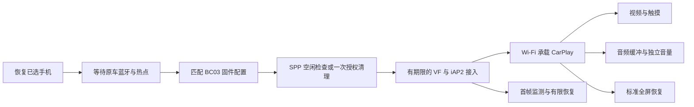

# CarConnect 0.1.12：完整功能与优化清单

本清单对应正式发布 `CarConnect-0.1.12-BC03-Unified-AV-Wheel-Android4.2plus-ARMv7`，更新于 2026-10-11。包含此前统一版功能，以及事件时间修正和旧安卓前台媒体入口维护；代码存在与主机测试通过不代替车机实测。

[下载正式版](https://github.com/beidouxiaonan/CarConnect/releases/tag/v0.1.12) · [音频与系统栏合并核对](https://github.com/beidouxiaonan/CarConnect/blob/codex/bc03-unified/BC03-UNIFIED-AV-MERGE-VERIFICATION.zh-CN.md) · [操作手册](USAGE.zh-CN.md) · [本版验证](VERIFICATION.zh-CN.md)

## 1. 连接与日常操作

| 功能 | 当前行为与使用条件 |
|---|---|
| 无线 CarPlay | 蓝牙建立 iAP2 控制通道，再通过车机 Wi-Fi 热点承载 CarPlay；手机需允许 CarPlay |
| USB 有线模式 | 保留原 USB 配对、网络通道及 CarPlay 流程；依赖车机 USB/系统支持，不能保证所有机型可用 |
| 原车 BC03 外接蓝牙 | 可启用原车路径，通过已核对服务和 gocsdk 连接，不把标准栈的 `t3` 名称当作外接模块 |
| 标准 Android 蓝牙路径 | 原车路径关闭时保留原标准栈流程；标准栈存在不等于外接模块可用 |
| 统一选择蓝牙配置 | 同一 APK 根据 BC03 版本、APK 和 gocsdk 指纹选择 1.7.2、1.7.9 或 1.3.6 策略 |
| 选择 / 更换 iPhone | 首次选择并保存地址和名称；明确更换才替换已有记录 |
| 记住手机 | 重启或重新打开后恢复选择；暂时断连、服务未就绪或另一手机接入时保留原记录 |
| 自动连接与暂停 | 使用原会话服务和开机恢复入口，按保存偏好等待；可暂停自动连接，清理未确认时本轮暂停 |
| 连接状态展示 | 显示蓝牙、热点、准备、等待手机、进入 CarPlay 和失败原因；“准备完毕”不当作已收到首帧 |
| 车机设置入口 | 打开蓝牙 / 无线设置，便于原车配对及开启热点 |
| Wi-Fi 名称与密码 | 查看热点信息；系统读取失败时可填写实际已有热点的 SSID、安全方式和密码并保存 |
| 返回 CarPlay / 打开设置 | 保留返回投屏入口及 CarPlay 内三指下滑打开设置 |

热点手填只补充连接所需信息，不能替代系统开启热点。开机恢复仍受车机自启动策略影响；原车 HFP 回连由车机固件负责，CarConnect 保存手机不等于替原车完成配对。卸载或清除应用数据会丢失本应用记录，同签名覆盖安装可保留数据。

## 2. 画面、输入与车机控制

| 功能 | 当前行为与使用条件 |
|---|---|
| CarPlay 画面和触摸 | 保留原 H.264 接收、解码、显示及触控传输；手机提供其支持的 CarPlay 应用 |
| 30 / 60fps 选择 | 设置视频请求上限，默认 30fps；保存后重新连接生效，60fps 不保证实际达到 60Hz/60fps |
| 屏幕刷新率显示 | 设置页显示车机系统报告的近似 Hz；不改变屏幕硬件刷新率 |
| 触摸发送队列 | 在独立线程发送，队列有界，连续移动可合并；按下、抬起等边界保持顺序 |
| 视频积压恢复 | 优先显示最新已解码输出；满足停滞条件时由解码工作线程重同步并请求关键帧 |
| 首帧有限自动恢复 | 原车无线控制启动后，前台且 Surface 有效、连续 60 秒未见首帧才重连；每个服务恢复周期最多 2 次 |
| Siri / 麦克风 | 保留 Siri 唤醒和车机麦克风开关，需录音权限及协商成功；修改麦克风选项后重新连接 |
| 方向盘按键学习 | 保留短按 / 长按学习及映射；支持上一曲、下一曲、播放、暂停、切换、语音、接听、挂断等动作，取决于固件是否把按键交给应用 |
| 方向盘时间去重修正 | 每次物理按下使用新的时间身份，同次重复投递仍去重；保留短按/长按，固定时间不再永久过滤 |
| 旧安卓媒体入口维护 | API17～20 在 CarPlay 前台且有焦点时维护已有媒体组件；离开、失焦、断开后不登记 |
| 车机媒体信息 | 保留媒体按键、播放信息和车机媒体中心接入；受实际系统接口及 iPhone 协议能力限制 |
| 标准全屏恢复 | 手动打开、回到前台、窗口获得焦点和进入 CarPlay 时重新申请隐藏本应用窗口系统栏 |

学习方向盘按键需先断开 CarPlay；学习期间不向 iPhone 发送控制命令。标准全屏请求不保证隐藏厂商独立悬浮 Dock，也不隐藏 CarPlay 画面自己的应用栏。

## 3. 声音功能与音频优化

| 功能 / 优化 | 当前实现及限制 |
|---|---|
| 导航独立音量 | 对独立 NAVIGATION 通道调整 0～100%，实时生效并保存 |
| 多媒体独立音量 | 对 MEDIA 通道调整 0～100%，用于音乐等媒体声音；100% 为原始增益，系统 / 功放仍影响最终响度 |
| 原音频焦点保留 | 用户增益乘以原来的焦点衰减，不接管全局系统音量；电话和 Siri 保持原音频路由 |
| 媒体起播预缓冲 | 继承 0.1.5 AV 修正，起播前真正积累 PCM；使用已有媒体缓冲参数，默认 300ms，也处理 500 / 1000ms 值 |
| 实际容量保护 | 按 AudioTrack 实际容量限制预填充阈值和写入量；容量未知时即时播放，避免停止状态写满后阻塞 |
| 断流补缓冲 | 队列耗尽且近期无新数据时暂停补缓冲，保留排队音频，不用 flush 丢掉未播音频 |
| 短音频尾部 | 不足预填充阈值也能在停收后播放，避免永久等待填满 |
| 音频线程调度 | 解码 / 写入线程请求 nice -8，UDP 音频接收线程请求 -4；系统拒绝时保留原调度并记录 |
| 独立即时通道 | 非 MEDIA 的导航、Siri、电话等保持即时播放；原 AAC / Opus / LPCM 能力和协商沿用基线 |

媒体缓冲参数来自原会话设置，不在本次额外新增三个缓冲按钮。若 iPhone 把导航播报混入 MEDIA，播报就随媒体音量和媒体缓冲变化，无法从混合后的音频中单独分离。缓冲可能增加起播或恢复延迟，实际受容量限制，不能补回已经丢失的数据。媒体音量功能也不意味着能投屏播放任意视频 App。

## 4. SPP 与无线连接保护

| 功能 / 优化 | 当前实现 |
|---|---|
| 启动状态检查 | 后台读取原车 SPP 状态；启动本身不发送断开命令，清理延后至真实连接请求 |
| 空闲通道直接连接 | 检查空闲稳定 300ms 后继续；空闲时不执行清理 |
| 连接前清理开关 | 新安装默认关闭；开启后在占用时请求一次原车 SppDisConnect，并等待确认 |
| 底层恢复独立开关 | 默认关闭，不沿用旧清理开关自动发 VH；明确开启后才允许已核对的底层恢复 |
| 持久化未完成记录 | 发断开请求前先保存标记；清理未确认时防止重启 / 新进程反复清理，通道确认空闲后解除 |
| 清理失败暂停 | 停止本轮自动重试，避免反复 VH / VF 干扰原车；保留自动连接偏好和已选手机 |
| 手动重新允许一次 | “允许再次清理一次”解除暂停，但不会立即发命令；仍检查活动会话、冷却和当前占用 |
| 连接请求互斥 | 防止并发建立，自己的活动通道不会被清理；关键阶段再次核对手机、模块及取消状态 |
| VF / 清理冷却 | 保留连接请求冷却和 45 秒清理冷却；等待期间不重复发送，空闲可直接继续 |
| 1.7.2 状态缺失验证 | 15 秒未上报 SPP 时允许一次限时协议接入，8 秒无接收关闭；不因 VF 写出就宣称成功 |
| 1.7.9 / 1.3.6 接入门槛 | 仍需原车报告 SPP 已连接，不套用 1.7.2 的状态缺失路径 |
| 本地 socket 写入修正 | 原始输出 flush 不等待对端排空内核队列；上层缓冲继续正确刷新，真实写入及关闭错误继续报告 |
| 分阶段期限 | 本地 socket、VF、状态等待、手机复核、地址登记和协议交接分别计时；建立总上限 45 秒 |
| 原始关闭原因保留 | 优先记录取消或超时的原因，减少后续 EBADF 掩盖前一阶段原因的情况 |

断开请求返回、VH / VF 已写出、socket 可访问以及收到少量字节，都不等于无线 CarPlay 成功。仍须经过原有 iAP2 协议和首帧确认。普通 APK 不能保证强制清除全局 SPP 或修复原厂服务 / 驱动中的占用。

## 5. 诊断、更新与安装兼容

| 功能 | 当前范围 |
|---|---|
| 连接诊断 | 查看和复制系统 SDK、热点接口、连接阶段、能力及失败信息 |
| 原车蓝牙诊断 | 读取模块就绪、本机名称 / MAC、HFP / A2DP、已连接手机与 SPP 状态 |
| SPP 诊断 | 原服务状态 / 广播观察、清理标记、C / S / T 阶段、收发字节与关闭原因；广播只作观察 |
| 视频诊断 | received、queued、decoded、rendered、texture 和厂商调用阶段，区分接收 / 解码 / 显示停滞 |
| 音频与系统栏诊断 | PCM 容量、queuedMs、maxWriteGapMs、rebuffers、prefill，以及全屏请求 / 当前值，可刷新复制 |
| 车机自检 | 保留认证、解码器、蓝牙和热点等自检入口；运行前先断开 CarPlay |
| 品牌与 GitHub 入口 | 启动器名称 CarConnect BC03；版本显示功能与适配标识；版本、说明、更新和关于入口保留维护者 GitHub 信息 |
| 数据兼容覆盖安装 | 沿用包名 `com.shihab.diplay.legacy` 和测试证书；同签名覆盖安装保留手机及设置 |
| 老 Android 打包 | minSdk17 / targetSdk28，DEX035、ARMv7、纯 V1；包含 Android 4.4 / 4.4.2 API19 的运行分流 |
| 构建校验 | 142 项主机回归通过（100 连接、17 AV、25 方向盘/生命周期）；保留基线审计，本版仅增加明确的方向盘/窗口通知 |

诊断数值不等于驱动级保证；例如 queuedMs 是估算，全屏位不直接检测厂商 Dock。故障反馈应复制完整当前诊断，包含实际版本和阶段，而不是只截最后一行。

## 6. 关键选项和建议

| 选项 | 默认或建议 | 生效方式 |
|---|---|---|
| 使用原车蓝牙连接 iPhone | 原车路径首次明确开启，需匹配已核对固件 | 重新连接 |
| 自动连接 | 使用已保存偏好；首次确认选择可开启 | 启动后恢复，依赖原车回连 |
| 视频帧率 | 默认 30fps，老车机先测试 30fps | 保存后重新连接 |
| 导航 / 媒体音量 | 默认分别 100%，按需要调节 | 实时并保存 |
| 连接前清理原车 SPP | 新安装默认关闭，升级保留原值 | 真实连接请求遇占用时检查 |
| 允许底层 SPP 恢复 | 默认关闭 | 占用且普通清理未释放时才可能使用 |
| 无线无首帧时自动重连 | 默认开启 | 原车无线控制启动、前台连续 60 秒无首帧，最多 2 次 |
| 系统栏恢复 | 自动随生命周期执行，无单独新增开关 | API17 / 18 标准隐藏，API19 及以上沉浸请求 |

首帧恢复不绕过 SPP 清理失败的暂停，也不解决尚未进入无线控制阶段的连接错误。厂商拒绝自动启动时需手动打开应用。

## 7. 适配范围与未解决项

| 项目 | 当前结论 |
|---|---|
| BC03 1.7.2 / 1.7.9 / 1.3.6 | 同 APK 已配置；仅匹配提供并核对过的实际服务 APK、gocsdk 和 Binder 接口 |
| BC03 1.7.3～1.7.8 / 其他版本 | 没有按版本区间自动放行；需私下提供实际 BC03BTService APK、Bluetooth.apk、gocsdk 及设备 / 日志后适配 |
| HSAE / 其他原车蓝牙服务 | 没有合入对应原车数据通道；不能套用 BC03 指令 |
| Android | 最低 Android 4.2/API17，含 4.4/API19；固件实际 SDK、权限、硬件能力分别决定可用性，型号标称不等于验证 |
| 安装文件 | 用户只装 CarConnect；原车已有 BC03 服务 / gocsdk 应保持原系统安装状态，无需 Root |
| K2001N 有线启动整机重启 | 尚未修复，使用无线；独立 USB 分阶段诊断版没有合入 |
| SD8227 点击图标无反应 / 专用启动修复 | SD8227 启动 / Multidex 分支没有合入，安装兼容与无线固件适配分别处理 |
| 厂商悬浮 Dock | 已有标准全屏优化；厂商独立栏仍需具体 Launcher / SystemUI 样本和车机验证 |
| 高负载卡音 / 停帧 / 持续 SPP 占用 | 已有缓冲、诊断和有限恢复，不能承诺全部消除；新统一版仍需目标车机实测 |

0.1.11 基线已完整核对 0.1.5 AV；0.1.12 保留音频与全屏实现，Activity 原全屏通知旁仅增加五个前台状态通知。方向盘改动修正可复现的重复时间过滤，不能确认已经覆盖所有厂商按键故障。[详细条件、所需系统文件及边界](COMPATIBILITY.zh-CN.md)。
